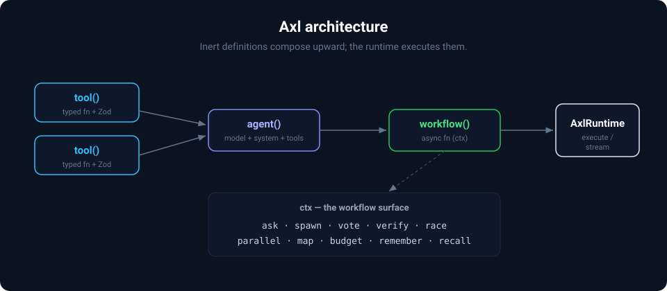

# Axl

[](https://www.npmjs.com/package/@axlsdk/axl)
[](https://www.npmjs.com/package/@axlsdk/axl)
[](https://github.com/axl-sdk/axl/actions/workflows/ci.yml)
[](#why-axl)
[](./LICENSE)

TypeScript SDK for orchestrating agentic systems. Treats concurrency, structured output, uncertainty, and cost as first-class primitives.

<p align="center">
  
</p>

> **Status:** Pre-1.0 (0.x). The core SDK is stable and covered by an extensive test suite; APIs may still change between minor versions, so pin a version in production. [Axl Studio](#axl-studio) is under active development.

## A 60-second taste

Most agent frameworks make you hand-roll retries and consensus. In Axl, running the same question through several agents in parallel and taking a majority vote is one call:

```typescript
const reliableMath = workflow({
  name: 'reliable-math',
  input: z.object({ question: z.string() }),
  handler: async (ctx) => {
    // Run 5 attempts concurrently...
    const results = await ctx.spawn(5, () =>
      ctx.ask(solver, ctx.input.question, { schema: z.object({ answer: z.number() }) }),
    );
    // ...then keep the answer that appeared most often.
    return ctx.vote(results, { strategy: 'majority', key: 'answer' });
  },
});
// `solver` is an agent({ model, system }). Full runnable version: examples/consensus.ts
```

**No DSL, no graph builder, no compiler — and zero runtime dependencies** (provider calls go through raw `fetch`). Axl is a plain TypeScript library you drop into an existing Node.js backend. [Run the examples →](./examples)

## Install

```bash
npm install @axlsdk/axl zod@^4
```

`zod` is a [peer dependency](https://nodejs.org/en/blog/npm/peer-dependencies) — installing it explicitly guarantees your app and Axl share **one** Zod instance (schemas are matched by identity, so a second copy breaks validation). The other packages are optional, installed as you need them: [`@axlsdk/testing`](./packages/axl-testing) (dev), [`@axlsdk/eval`](./packages/axl-eval), and [`@axlsdk/studio`](./packages/axl-studio) (dev).

Set an API key for at least one provider:

```bash
export OPENAI_API_KEY=sk-...
# or
export ANTHROPIC_API_KEY=sk-ant-...
# or
export GOOGLE_API_KEY=...
```

## Core Concepts

Axl has four building blocks. Each is an inert definition until you run it — no side effects at import time.

**Tools** are typed functions that agents can call. Inputs are validated with Zod.

**Agents** are LLM configurations: a model, a system prompt, and a set of tools. An agent does nothing on its own — it's activated when you call `ctx.ask()`.

**Workflows** are named async functions that orchestrate agents. The workflow handler receives `ctx` (a `WorkflowContext`), which provides all of Axl's primitives: `ask`, `spawn`, `vote`, `verify`, `budget`, `race`, `parallel`, `map`, `remember`, `recall`, and more.

**Runtime** registers workflows and executes them. It manages providers, state, and configuration.

<p align="center">
  
</p>

## Getting Started

Create a file called `app.ts`:

```typescript
import { tool, agent, workflow, AxlRuntime } from '@axlsdk/axl';
import { z } from 'zod';

// 1. Define a tool — a typed function the agent can call
const calculator = tool({
  name: 'calculator',
  description: 'Evaluate a math expression',
  input: z.object({ expression: z.string() }),
  handler: ({ expression }) => {
    const result = new Function(`return (${expression})`)();
    return { result };
  },
});

// 2. Define an agent — an LLM with tools and a system prompt
//    Model format is provider:model. Reads API key from env automatically.
//    Swap in any supported model (anthropic:claude-sonnet-4-6, google:gemini-3.1-pro-preview, …).
const mathAgent = agent({
  model: 'openai-responses:gpt-5.5',
  system: 'You are a math assistant. Use the calculator for all arithmetic.',
  tools: [calculator],
});

// 3. Define a workflow — an async function that orchestrates agents via ctx
const solve = workflow({
  name: 'solve',
  input: z.object({ question: z.string() }),
  handler: async (ctx) => {
    return ctx.ask(mathAgent, ctx.input.question);
  },
});

// 4. Create a runtime, register the workflow, and run it
const runtime = new AxlRuntime();
runtime.register(solve);

const answer = await runtime.execute('solve', { question: 'What is 42 * 17?' });
console.log(answer);
```

Run it:

```bash
npx tsx app.ts
```

The agent receives the question, decides to call the `calculator` tool, gets the result, and returns a natural language answer. Axl handles the tool-calling loop, input validation, and response parsing automatically.

## Reliable Tool Workflows

Tool-using assistants need to explain more than the final answer. Axl records whether
each accepted tool call succeeded, failed, was denied, or was cancelled. Requests that
cannot start are recorded separately as rejected, so an unavailable tool is not
mistaken for one that ran and failed.

Known failures can give the model a safe explanation while keeping internal error
details inside your application. Unexpected errors stop the workflow instead of being
quietly turned into model input.

Axl also marks an observed or saved run as incomplete when events were lost, the
process stopped, or concurrent work could not finish shutting down in time. Studio,
audits, and eval tooling can then avoid treating a partial history as the whole story.
See the [observation migration guide](./docs/migration/stream-first-observation.md) for
the exact behavior and upgrade steps.

## Structured Output

Agents return strings by default. Pass a `schema` to `ctx.ask()` to get typed, validated objects back. The schema is sent to the LLM — if it returns invalid JSON, Axl feeds the validation error back and retries automatically:

```typescript
const extract = workflow({
  name: 'extract',
  input: z.object({ problem: z.string() }),
  handler: async (ctx) => {
    return ctx.ask(mathAgent, `Extract the numbers and operation: ${ctx.input.problem}`, {
      schema: z.object({
        operands: z.array(z.number()),
        operation: z.enum(['add', 'subtract', 'multiply', 'divide']),
      }),
    });
  },
});

runtime.register(extract);
const result = await runtime.execute('extract', { problem: 'What is 42 times 17?' });
// { operands: [42, 17], operation: 'multiply' }
```

## Concurrency + Consensus

Run the same question through multiple agents in parallel and pick the most common answer:

```typescript
const answerSchema = z.object({ answer: z.number() });

const pipeline = workflow({
  name: 'reliable-math',
  input: z.object({ question: z.string() }),
  // output schema validates your orchestration logic — catches bugs in spawn/vote assembly,
  // separate from the ask schema which instructs the LLM
  output: answerSchema,
  handler: async (ctx) => {
    // spawn runs 3 concurrent instances — returns Result<T>[] (each is { ok, value } or { ok, error })
    const results = await ctx.spawn(3, async (_index) =>
      ctx.ask(mathAgent, ctx.input.question, { schema: answerSchema }),
    );

    // vote extracts successful values and picks the answer that appeared most often
    return ctx.vote(results, { strategy: 'majority', key: 'answer' });
  },
});
```

Other strategies: `unanimous`, `highest`, `lowest`, `mean`, `median`, and `custom` with a reducer function. See the [vote reference](./docs/use-cases.md#vote-strategy-reference).

## Cost Control

Wrap any execution in a budget. When the limit is hit, Axl stops the agent:

```typescript
const budgeted = workflow({
  name: 'budgeted-solve',
  input: z.object({ question: z.string() }),
  handler: async (ctx) => {
    // budget() returns { value, budgetExceeded, totalCost }
    const { value } = await ctx.budget({ cost: '$0.50', onExceed: 'hard_stop' }, async () => {
      return ctx.ask(mathAgent, ctx.input.question);
    });
    return value;
  },
});
```

Policies: `hard_stop` (abort immediately), `finish_and_stop` (let the current turn finish), `warn` (log and continue).

## Streaming

`runtime.stream()` returns an `AxlStream` — an async iterable that emits tokens, tool calls, and trace events as they happen:

```typescript
const stream = runtime.stream('solve', { question: 'What is 42 * 17?' });

for await (const event of stream) {
  if (event.type === 'token') process.stdout.write(event.data);
  if (event.type === 'tool_call_end') console.log(`Called tool: ${event.tool}`);
}

const result = await stream.promise; // final output after stream completes
```

`runtime.execute()` is final-result-only and does **not** accept `onToken` or any other event callback — `runtime.stream()` is the streaming surface from the outside. For observation **from inside a workflow handler** — e.g., streaming `partial_object` snapshots between two `ctx.ask()` calls — read `ctx.events`:

```typescript
const planSchema = z.object({ outline: z.array(z.string()) });
const draftSchema = z.object({ draft: z.string() });
const planner = agent({ model: 'openai-responses:gpt-5.5', system: 'Plan an outline.' });
const writer = agent({ model: 'openai-responses:gpt-5.5', system: 'Write the draft.' });

const wf = workflow({
  name: 'two-step',
  input: z.object({ topic: z.string() }),
  handler: async (ctx) => {
    // Allocate the bus first — `ctx.events` is a lazy getter; until
    // any code accesses it the bus is undefined and `ctx.ask` skips
    // the streaming path. Touching it here (synchronously) wires
    // subsequent asks for streaming.
    const events = ctx.events;
    void (async () => {
      for await (const partial of events.partialObjects) {
        // partial: { askId, agent?, object, attempt }
        console.log(`[ask ${partial.askId} attempt ${partial.attempt}]`, partial.object);
      }
    })().catch((err) => console.error('observer failed:', err));

    const plan = await ctx.ask(planner, ctx.input.topic, { schema: planSchema });
    return ctx.ask(writer, JSON.stringify(plan), { schema: draftSchema });
  },
});
```

`ctx.events` exposes the same `AxlEvent` iterable + curated views as `AxlStream` (`.text`, `.lifecycle`, `.textByAsk`, `.partialObjects`, `.stringStream`). For background telemetry across every run, subscribe with `runtime.on('trace', event => …)` instead — those four channels are alternatives, not additive (don't sum costs from two of them). See [docs/observability.md](docs/observability.md#observation-paths) for the full comparison and the [migration guide](docs/migration/stream-first-observation.md) for upgrade notes.

### Char-by-char streaming of long string fields

`partial_object` snapshots are throttled to JSON structural seams — they don't fire while a string is mid-flight, so a 4 KB `summary` field appears all at once when the closing quote lands. For chat-style typewriter rendering, subscribe to `stringStream` and bind your UI to `event.accumulated`:

```typescript
const stream = runtime.stream('summarize', { text });

// Render `/summary` char-by-char as it streams
for await (const e of stream.stringStream({ path: '/summary' })) {
  setText(e.accumulated); // running text-so-far
}
```

`path` is an [RFC 6901](https://datatracker.ietf.org/doc/html/rfc6901) JSON Pointer — `/summary`, `/sources/0/title`. Late subscribers see the current state on first iteration. Filter by `askId` for fan-out workflows. For browser SPAs receiving raw events over WebSocket / SSE, `stringStreamFromEvents(source, opts)` reconstructs the same view client-side without pulling Node deps. See [docs/observability.md](./docs/observability.md#picking-the-right-view) for the decision matrix and the React recipe.

## Sessions

Multi-turn conversations with persistent history. Pass a session ID to `runtime.session()` — messages are grouped by this ID, so the same user gets continuity across calls:

```typescript
const session = runtime.session('user-123');

const r1 = await session.send('solve', { question: 'What is 10 + 5?' });
const r2 = await session.send('solve', { question: 'Now multiply that by 3' });
// Each send() appends to the conversation history, so the agent has full context across turns
```

## State Persistence & Recovery

Production-grade state stores with multi-tenant namespacing, TTL-driven retention, and crash survival.

```typescript
import { AxlRuntime, RedisStore } from '@axlsdk/axl';

const store = await RedisStore.create({
  url: process.env.REDIS_URL!,
  keyPrefix: 'axl:prod:',          // namespace for shared-cluster isolation
  defaultTtl: 60 * 60 * 24 * 30,   // 30-day retention
  ttls: {
    streamingEvents: 60 * 60 * 24 * 7,  // safety net for missed recovery
  },
});

const runtime = new AxlRuntime({
  state: { store, persist: 'streaming' },  // flush traces during the run
});

// Boot sequence: hydrate, recover, accept new work
await runtime.getExecutions();
const recovered = await runtime.recoverIncompleteStreams();
console.log(`Recovered ${recovered.length} crashed executions`);
```

**Crash survival.** With `state.persist: 'streaming'`, events flush to the store throughout the run. A mid-execution crash leaves a recoverable trace; `runtime.recoverIncompleteStreams()` synthesizes partial `ExecutionInfo`s on the next process.

**GDPR right-to-be-forgotten.** `runtime.deleteExecution(id)` sweeps every per-execution surface (data + indexes + checkpoints + suspended state + streaming buffer + pending decisions) in one atomic call. Emits `execution_deleted` for the audit trail.

```typescript
runtime.on('execution_deleted', (e) => auditLog.write({ ...e }));
await runtime.deleteExecution(executionId);
```

**Queryable per-execution tags.** `ExecutionInfo.metadata` round-trips from `ExecuteOptions.metadata` (`userId`, `tenantId`, correlation ids) — filter via `runtime.getExecutions()`. Studio scrubs metadata under `trace.redact: true`.

See [docs/migration/state-store-durability.md](./docs/migration/state-store-durability.md) for the full design.

## Providers

Four native adapters, zero SDK dependencies (raw `fetch`). Set the corresponding env var and use the `provider:model` URI:

| Provider                  | URI prefix          | Env var                              |
| ------------------------- | ------------------- | ------------------------------------ |
| OpenAI (Responses API)    | `openai-responses:` | `OPENAI_API_KEY`                     |
| OpenAI (Chat Completions) | `openai:`           | `OPENAI_API_KEY`                     |
| Anthropic                 | `anthropic:`        | `ANTHROPIC_API_KEY`                  |
| Google Gemini             | `google:`           | `GOOGLE_API_KEY` or `GEMINI_API_KEY` |

```typescript
agent({ model: 'openai-responses:gpt-5.5', ... })
agent({ model: 'anthropic:claude-sonnet-4-6', ... })
agent({ model: 'google:gemini-3.1-pro-preview', ... })
```

Beyond the four, a generic OpenAI-compatible engine ships presets for any endpoint that speaks the OpenAI Chat Completions format — pick a model with `preset:model` and set the matching env var:

```typescript
agent({ model: 'openrouter:anthropic/claude-opus-4.7', ... }) // 300+ models, one key
agent({ model: 'groq:openai/gpt-oss-120b', ... })             // fastest inference
agent({ model: 'ollama:llama3', ... })                        // local — no key, $0
```

Presets: `openrouter`, `azure`, `xai`, `deepseek`, `mistral`, `groq`, `bedrock`, plus self-hosted `ollama` / `vllm` / `lmstudio` / `llamacpp` / `sglang`. The unified `effort` knob and per-call cost tracking work across them; build your own by cloning a `ProviderProfile`.

The `effort` parameter controls reasoning depth identically across all providers:

```typescript
agent({ model: 'openai-responses:gpt-5.5', effort: 'high', ... })  // OpenAI reasoning effort
agent({ model: 'anthropic:claude-opus-4-6', effort: 'high', ... }) // Anthropic adaptive thinking
agent({ model: 'google:gemini-3.1-pro-preview', effort: 'high', ... }) // Gemini thinking level
```

See [docs/providers.md](./docs/providers.md) for the full model list and effort mapping.

## Testing

Test workflows without API keys using `MockProvider`:

```bash
npm install -D @axlsdk/testing
```

```typescript
import { AxlTestRuntime, MockProvider } from '@axlsdk/testing';

const runtime = new AxlTestRuntime();
runtime.register(solve);

// MockProvider returns canned responses in sequence (mock the provider the agent uses)
runtime.mockProvider(
  'openai-responses',
  MockProvider.sequence([
    // First response: agent decides to call the calculator tool
    {
      content: '',
      tool_calls: [
        {
          id: 'call_1',
          type: 'function',
          function: { name: 'calculator', arguments: '{"expression":"42 * 17"}' },
        },
      ],
    },
    // Second response: agent uses the tool result to answer
    { content: 'The answer is 714.' },
  ]),
);

const result = await runtime.execute('solve', { question: 'What is 42 * 17?' });
expect(result).toContain('714');
expect(runtime.toolCalls('calculator')).toHaveLength(1);
```

## Why Axl

Most LLM frameworks treat agents as sequential pipelines. Real agentic systems need concurrency, consensus, cost control, and human oversight. Axl makes these first-class primitives:

- **Uncertainty is the Default.** LLM output is probabilistic. `verify` and `vote` replace manual retry loops with self-correcting validation and multi-agent consensus — not patterns you reinvent per project.
- **Concurrency Built In.** `spawn`, `race`, `parallel`, and `map` with quorum support. Run agents in parallel and resolve when enough agree.
- **Resource Awareness.** `budget` with hard_stop, finish_and_stop, and warn policies. Cost control is a first-class API, not an afterthought.
- **Just TypeScript.** Plain async functions, Zod schemas, full IDE support. No DSL, no graph builder, no compiler. Axl is a library that embeds in your existing Node.js backend.

## Axl Studio

A local dev UI for watching agents and workflows run — a waterfall trace explorer, a live cost dashboard, an eval runner with baseline-vs-candidate comparison, and an agent playground. Point it at your runtime and go:

```bash
npx @axlsdk/studio --open
```

<p align="center">
  
</p>

Studio also embeds as middleware (Express, Fastify, NestJS, raw HTTP) with auth and read-only modes. See the [Studio README](./packages/axl-studio).

## Packages

| Package                                     | Description                                                                      |
| ------------------------------------------- | -------------------------------------------------------------------------------- |
| [`@axlsdk/axl`](./packages/axl)             | Core SDK: tools, agents, workflows, runtime, providers, state stores             |
| [`@axlsdk/testing`](./packages/axl-testing) | Test utilities: MockProvider, MockTool, AxlTestRuntime                           |
| [`@axlsdk/eval`](./packages/axl-eval)       | Evaluation framework: datasets, scorers, LLM-as-judge, CLI + Studio integration  |
| [`@axlsdk/studio`](./packages/axl-studio)   | Development UI + embeddable middleware for debugging agents, workflows, and evals |

## Documentation

| Guide                                    | Description                                                                              |
| ---------------------------------------- | ---------------------------------------------------------------------------------------- |
| [Examples](./examples)                   | Runnable, self-contained programs: quickstart, parallel consensus, agent handoffs        |
| [API Reference](./docs/api-reference.md) | All `ctx.*` primitives, option types, valid values, and defaults                         |
| [Architecture](./docs/architecture.md)   | System architecture, deployment modes, and execution flow                                |
| [Providers](./docs/providers.md)         | Native OpenAI/Anthropic/Gemini adapters + OpenAI-compatible presets, effort mapping, typed errors |
| [Use Cases](./docs/use-cases.md)         | Real-world examples: support bots, consensus, budget control, handoffs, batch processing |
| [Testing](./docs/testing.md)             | MockProvider, AxlTestRuntime, snapshot testing, assertion helpers                        |
| [Observability](./docs/observability.md) | Trace modes, OpenTelemetry integration, cost-per-span attribution                        |
| [Security](./docs/security.md)           | Tool ACL, input sanitization, prompt injection mitigations                               |
| [Integration](./docs/integration.md)     | Express.js integration, Axl Studio setup, local development workflow                     |
| [Roadmap](./ROADMAP.md)                  | What's planned for Axl                                                                   |

## How Axl Compares

Axl competes primarily with [Mastra](https://mastra.ai) and [LangGraph.js](https://github.com/langchain-ai/langgraphjs) in the TypeScript agent framework space. Here's an honest comparison:

|                        | Axl                                                  | Mastra                                                              | LangGraph.js                          |
| ---------------------- | ---------------------------------------------------- | ------------------------------------------------------------------- | ------------------------------------- |
| **Workflow style**     | Plain async functions with `ctx.*`                   | Step chain (`.then().branch().parallel()`)                          | Explicit graph (`addNode`, `addEdge`) |
| **Concurrency**        | `spawn`, `race`, `parallel`, `map` with quorum       | `.parallel()`, `.foreach()`                                         | `Send` API (fan-out)                  |
| **Consensus / voting** | `vote` (7 strategies), `verify`                      | —                                                                   | —                                     |
| **Cost control**       | `budget` with hard_stop / finish_and_stop / warn     | Token reporting only                                                | —                                     |
| **Structured output**  | Zod schema on `ctx.ask()` + self-correcting retry    | Zod via Vercel AI SDK                                               | `withStructuredOutput()`              |
| **Human-in-the-loop**  | `awaitHuman` + tool approval gates (in-process; cross-process exactly-once protocol is application-managed) | Tool suspend/resume, `requireApproval`                              | `interrupt()` + `Command`             |
| **Testing utilities**  | `MockProvider`, `MockTool`, `AxlTestRuntime`         | —                                                                   | —                                     |
| **Evaluation**         | `dataset`, `scorer`, `llmScorer`, `evalCompare`, CLI | Built-in scorers (`@mastra/evals`)                                  | Via LangSmith (external)              |
| **Agent handoffs**     | `handoffs` with ACL isolation, oneway + roundtrip, agent-as-tool | Sub-agents as tools                                                 | Subgraphs as nodes                    |
| **Memory**             | Working memory + semantic recall (vector stores)     | Working memory + semantic recall + observational (auto-compression) | Checkpointer-based                    |
| **Observability**      | OpenTelemetry with cost-per-span                     | OpenTelemetry built-in                                              | LangSmith integration                 |
| **Streaming**          | `AxlStream` + `stringStream` (per-field char-level)   | Via Vercel AI SDK (`streamObject` partials)                         | Multiple modes (token / values / updates) |
| **Local dev UI**       | Axl Studio                                           | Mastra Studio                                                       | LangGraph Studio                      |
| **Deployment**         | Manual                                               | One-command (Vercel, CF, Netlify)                                   | LangGraph Platform                    |
| **Dependencies**       | Zero (raw `fetch`)                                   | Vercel AI SDK                                                       | `@langchain/core` ecosystem           |
| **Durable execution**  | Checkpoint storage + streaming trace recovery; cross-process workflow/approval replay is not yet atomic | Workflow suspend/resume                                             | Checkpointers (every superstep)       |

**Where Axl shines:** Concurrency primitives, consensus/voting, cost control, testing story, zero dependencies, and imperative workflow style (plain TypeScript, no DSL).

**Where others are ahead:** Mastra has more vector store adapters, observational memory (auto-compression), and one-command deployment. LangGraph has more mature durable execution and a larger Python ecosystem. Both have more established communities.

## Requirements

- Node.js >= 20.0.0
- TypeScript >= 5.7 (recommended)

## License

[Apache 2.0](./LICENSE)
