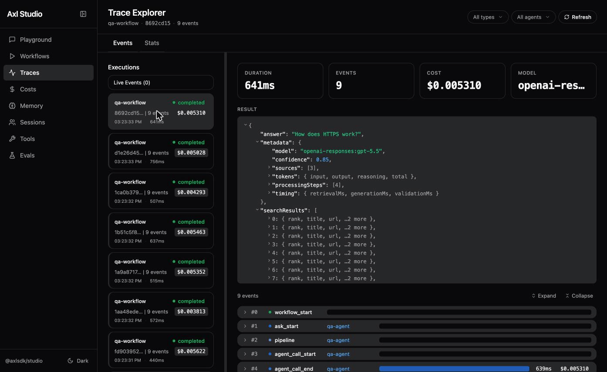
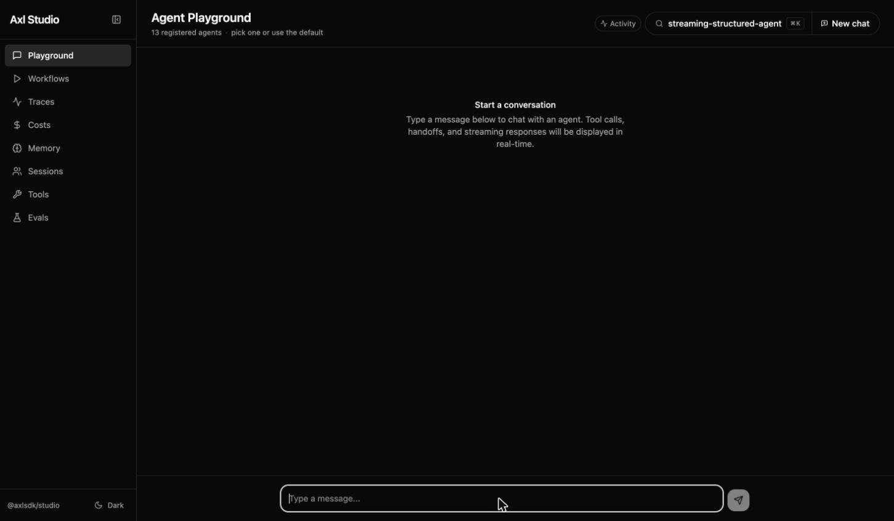
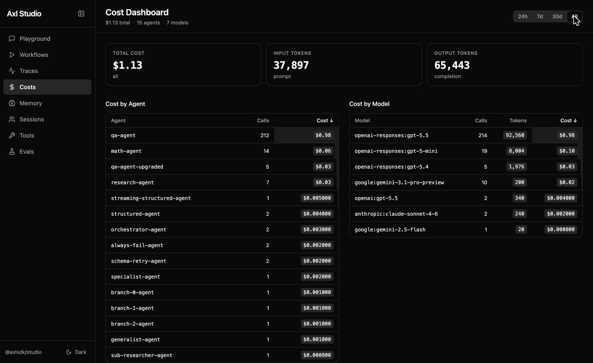
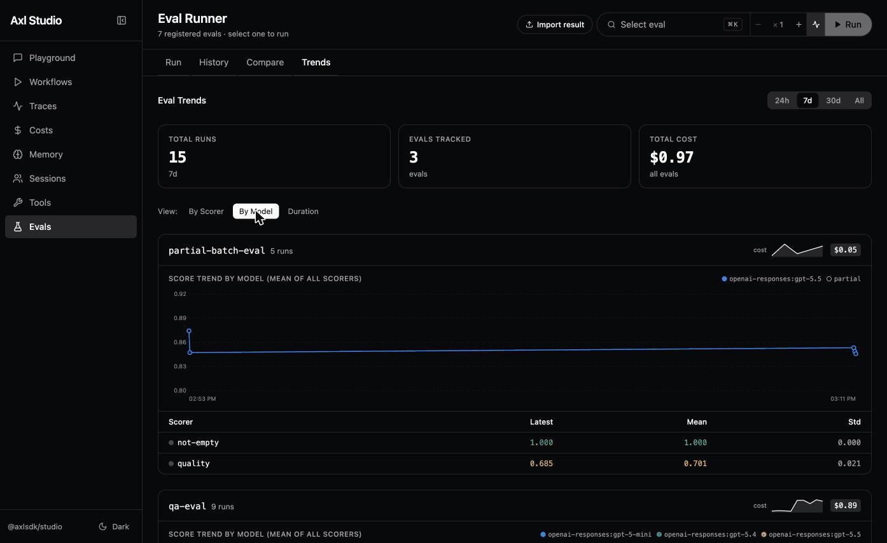

# @axlsdk/studio

[](https://www.npmjs.com/package/@axlsdk/studio)

Local development UI for debugging, testing, and iterating on [Axl](https://github.com/axl-sdk/axl) agents and workflows.

<p align="center">
  
</p>

## Installation

```bash
npm install -D @axlsdk/studio
```

Or run directly with npx (no install needed):

```bash
npx @axlsdk/studio
```

**Requirements:** Node.js 20+, an existing Axl project with `@axlsdk/axl` installed.

## Quick Start

### 1. Create a config file

Studio needs a config file at your project root that default-exports an `AxlRuntime`. It auto-detects in this order: `axl.config.mts` → `axl.config.ts` → `axl.config.mjs` → `axl.config.js`. Use `.mts` for configs with top-level `await` or in projects without `"type": "module"` in package.json.

The recommended pattern is to keep your tools, agents, workflows, and runtime in your application code, then re-export the runtime for Studio to discover:

```
src/
  config.ts              — defineConfig (providers, state, trace)
  runtime.ts             — creates AxlRuntime, registers everything
  tools/                 — tool definitions (wrap your services)
  agents/                — agent definitions (import their tools)
  workflows/             — workflow definitions (orchestrate agents)
axl.config.mts           — re-exports runtime for Studio
```

```typescript
// src/runtime.ts
import { AxlRuntime } from '@axlsdk/axl';
import { config } from './config.js';
import { handleTicket } from './workflows/handle-ticket.js';
import { supportAgent } from './agents/support.js';
import { lookupOrder } from './tools/db.js';

export const runtime = new AxlRuntime(config);
runtime.register(handleTicket);
runtime.registerAgent(supportAgent);
runtime.registerTool(lookupOrder);
```

```typescript
// axl.config.mts — thin entry point for Studio
import { runtime } from './src/runtime.js';
export default runtime;
```

Your application imports from `src/runtime.ts` directly. Studio discovers everything via `axl.config.mts`. See the [`@axlsdk/axl` README](../axl/README.md#project-structure) for the full recommended project structure.

### 2. Start Studio

```bash
npx @axlsdk/studio --open
```

This loads your config and starts the server on `http://127.0.0.1:4400`. The
standalone CLI binds only to IPv4 loopback, emits no CORS headers, and accepts
browser WebSocket connections only from local origins.

## CLI Options

```
axl-studio [options]

Options:
  --port <number>          Server port (default: 4400)
  --config <path>          Path to config file (default: auto-detect)
  --conditions <list>      Comma-separated Node.js import conditions (e.g., development)
  --open                   Auto-open browser
  -h, --help               Show help
```

The `--conditions` flag is useful in monorepos where workspace packages use the `"development"` export condition to point at source instead of built dist files. Pass `--conditions development` to resolve imports through source paths.

**Note:** `--conditions` only applies to ESM `import()` resolution. Transitive `require()` calls from packages without `"type": "module"` bypass the hook and use default conditions. If a dependency loads via CJS, it will still resolve from `dist/` regardless of the flag.

## Panels

Eight panels, all live over WebSocket. The captures below use representative seeded
runs; see [`docs/assets/CAPTURE.md`](../../docs/assets/CAPTURE.md) for how to regenerate
them.

### Agent Playground

Chat with any registered agent in real time. Streaming tokens, tool calls with expandable input/output, and multi-turn history.

<p align="center">
  
</p>

### Trace Explorer

Waterfall visualization of execution traces. Filter by type, agent, or tool; see token
counts, cost per step, and duration. Tool rows distinguish calls that succeeded,
failed, were denied, were cancelled, or were rejected before they started. Studio also
keeps older trace history readable and identifies incomplete runs instead of presenting
missing events as a complete story. The Stats view shows the event-type distribution,
top tools, and retry stacks.

> **Studio vs `ctx.events`.** Studio consumes the same `AxlEvent` firehose via `runtime.on('trace', …)` — every event from every execution. Inside a workflow handler, `ctx.events` is the in-handler counterpart (per-context, scoped to the current workflow). The two coexist: Studio is for cross-execution observability and replay; `ctx.events` is for in-handler streaming UIs. See [`docs/observability.md`](../../docs/observability.md#observation-paths).

### Cost Dashboard

Track spending across agents, models, workflows, and embedders with time-window filtering (24h/7d/30d/all). Sortable breakdown tables, a **Retry Overhead** section that decomposes cost by `retryReason` when retries happen, and a **Memory (Embedder)** section bucketed by embedder model. Sub-cent values use tiered precision so embedder costs don't collapse to `$0.0000`. Calls to unpriced models (a pricing-table miss, or a provider that reports no per-call cost) render as `≥ $X` with an "N unpriced calls" note, so the total reads as an honest lower bound rather than a misleading exact figure.

<p align="center">
  
</p>

### Eval Runner

Run evaluations from the UI, watch items stream in, and drill into per-item scores,
timing, cost, and LLM-judge reasoning. Compare two runs (baseline vs candidate) with
bootstrap-CI significance, a score-distribution chart, and an item-level diff table.
The History tab groups multi-run results and tracks mean scores across runs. Toggle
**Capture traces** to render each item's events inline. For tool-using workflows, those
events show whether a call failed, was denied, was cancelled, or never started, giving
you better evidence for debugging and custom scorers. Studio does not turn those states
into scores automatically. Requires `@axlsdk/eval` as an optional peer dependency.

Amber banners flag runs you shouldn't fully trust — a scorer that failed on too many items, a subset run, or annotations dropped by the dataset schema — so a thinned or misconfigured run can't quietly look clean.

<p align="center">
  
</p>

### Workflow Runner

Execute workflows with custom JSON input. View execution timelines showing each agent call, tool invocation, and cost. A Stats tab surfaces per-workflow p50/p95 and failure rates.

### Memory Browser

View and manage agent memory (session and global scope). Create, edit, and delete entries; test semantic recall queries.

### Session Manager

Browse active sessions with conversation history. Replay sessions step by step; view handoff chains between agents. Each assistant message is badged with its originating agent.

### Tool Inspector

Browse all registered tools with their schemas rendered as forms. Test any tool directly with custom input and see the result.

## What gets registered

Studio discovers your project through the `AxlRuntime` instance. Use these methods to make things visible:

| Method | What it exposes |
|--------|----------------|
| `runtime.register(workflow)` | Workflows (Workflow Runner, Playground) |
| `runtime.registerAgent(agent)` | Agents (Playground agent picker) |
| `runtime.registerTool(tool)` | Tools (Tool Inspector) |
| `runtime.registerEval(name, config)` | Evals (Eval Runner) |

Workflows are required for execution. Agents and tools are optional but recommended — they power the Playground agent picker and Tool Inspector panels. Evals require `@axlsdk/eval` as a peer dependency.

## Embeddable Middleware

For apps using dependency injection (NestJS, etc.) or an existing HTTP server, Studio mounts as middleware instead of running as a standalone CLI. Works with Express, Fastify, Koa, NestJS, raw `http.Server`, and Hono-in-Hono.

```typescript
import express from 'express';
import { AxlRuntime } from '@axlsdk/axl';
import { createStudioMiddleware } from '@axlsdk/studio/middleware';

const studio = createStudioMiddleware({
  runtime,
  basePath: '/studio',
  // WebSocket upgrades bypass Express middleware — always authenticate here.
  verifyUpgrade: (req) => authenticateStudioRequest(req)?.isAdmin === true,
});

const app = express();
const authenticateStudioHttp: express.RequestHandler = (req, res, next) => {
  if (authenticateStudioRequest(req)?.isAdmin !== true) return res.sendStatus(403);
  next();
};
app.use('/studio', authenticateStudioHttp, studio.handler);
const server = app.listen(3000);
studio.upgradeWebSocket(server); // required for live data
```

Key options: `readOnly` (disable mutating endpoints for production monitoring), `evals` (lazy-load eval files), `filterTraceEvent` (per-tenant broadcast scoping), `bufferCaps` (WS replay-buffer limits). `basePath` must match your framework's mount path.

**See [`docs/studio-api.md`](../../docs/studio-api.md) for the full reference:** every REST endpoint, the WebSocket protocol, the complete middleware options/return tables, NestJS/Fastify/Hono examples, host body-limit guidance, lazy eval loading, multi-tenant setup, and the internal architecture.

## Security

- **Treat Studio as an administrative surface, never as a public application
  API.** Agent routes intentionally expose resolved system prompts, tool
  descriptions, schemas, and runtime configuration. `trace.redact` protects
  user/model observability content; it is not authentication and does not hide
  static agent configuration.
- Protect the Studio HTTP mount with your framework's authentication and
  authorization middleware.
- **Always** provide `verifyUpgrade` — WebSocket upgrades bypass Express/Fastify/Koa middleware, so your auth middleware does **not** protect WebSocket connections.
- Consider `readOnly: true` for production monitoring — view traces, costs, and schemas without execution capability.
- CORS is not applied in embedded mode — the host framework owns CORS policy.
- `basePath` is validated against unsafe characters and path traversal.

### Redaction

When the runtime is constructed with `config.trace.redact: true`, Studio scrubs user/LLM content at three boundaries (trace emission, REST serialization, WS broadcast) while preserving structural metadata (IDs, names, roles, cost/token/duration, timestamps).

```typescript
const runtime = new AxlRuntime({ trace: { redact: true } });
const studio = createStudioMiddleware({ runtime });
```

See the [redaction section in the API reference](../../docs/studio-api.md#observability-boundary-redaction) and the [scrubbed/preserved field table](../../docs/observability.md#pii-and-redaction).

## Development

```bash
# Install dependencies
pnpm install

# Build everything (client then server)
pnpm --filter @axlsdk/studio build

# Dev mode (Vite HMR + server watch, seeded with dev-fixtures)
pnpm --filter @axlsdk/studio dev

# Type check
pnpm --filter @axlsdk/studio typecheck
```

## License

Apache-2.0
